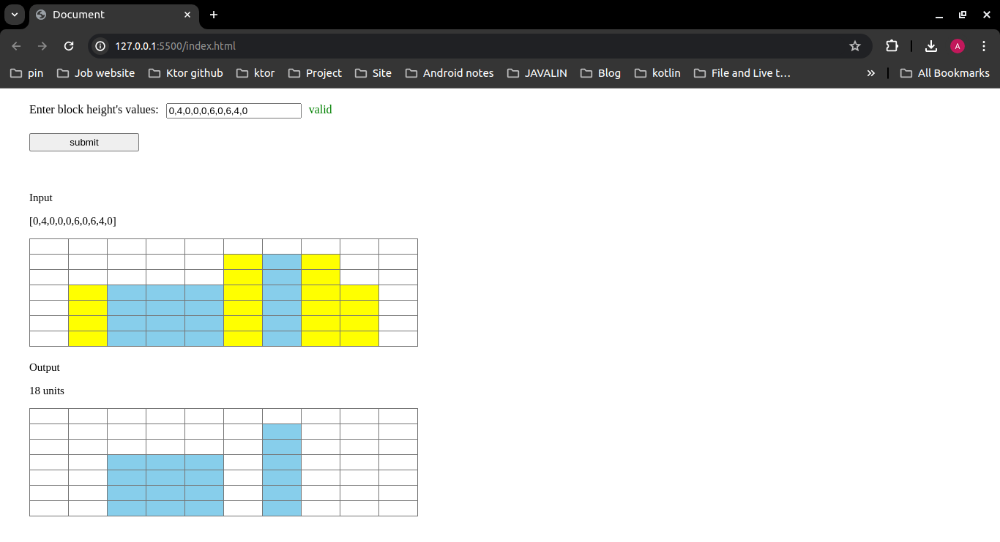
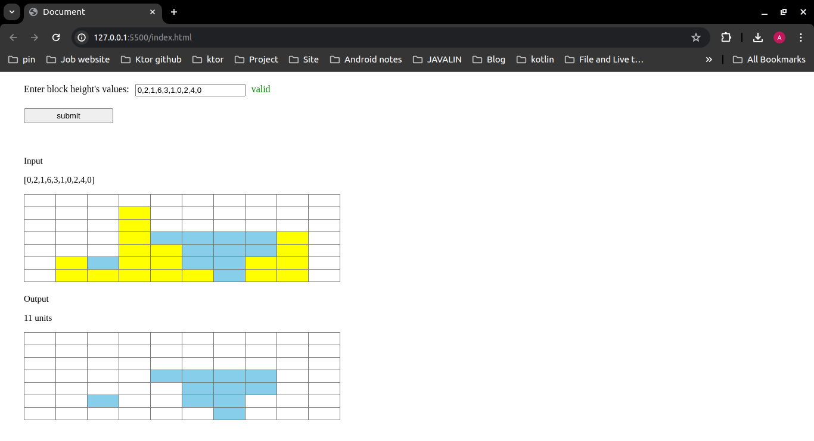
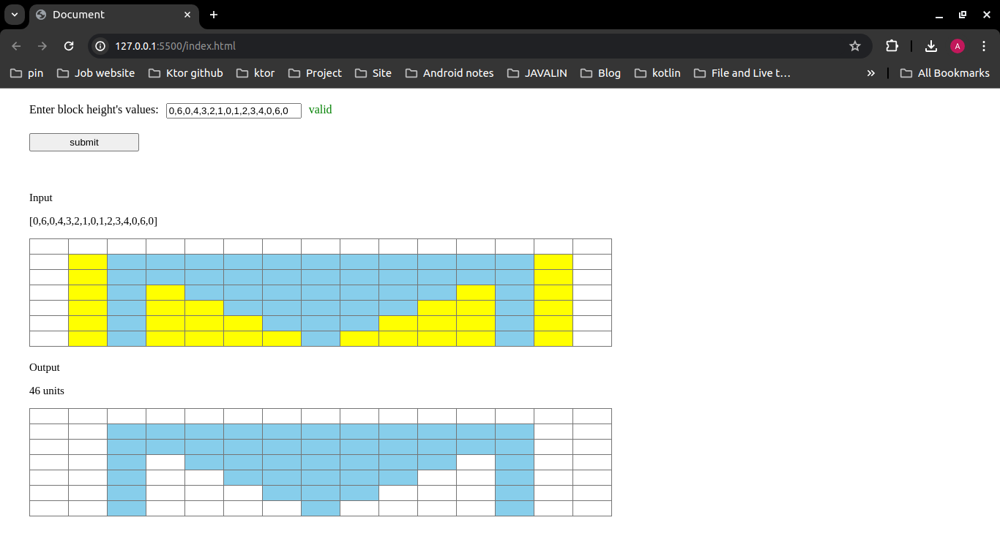

# Water Tank Problem

### Test case 1

Input  
[0,4,0,0,0,6,0,6,4,0]

Output  
18 units

### Test case 2

Input  
[0,2,1,6,3,1,0,2,4,0]

Output  
11 units

### Test case 3

Input  
[0,6,0,4,3,2,1,0,1,2,3,4,0,6,0]

Output  
46 units

